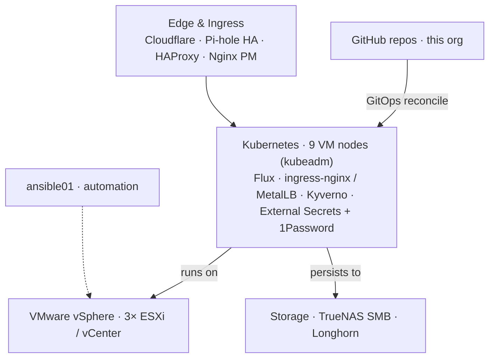

# vollminlab

**A self-hosted homelab run as a production system — every layer defined as code, continuously reconciled, and built to recover.**

---

**vollminlab** is a self-hosted homelab operated with production discipline. At its core is a self-managed Kubernetes cluster — nine nodes running as VMs across a three-host VMware vSphere environment — with every workload, policy, and secret defined as code and reconciled continuously from Git. Supporting infrastructure (virtualization, storage, DNS and HA load balancing, and reverse proxy) is captured as code in [`homelab-infrastructure`](https://github.com/vollminlab/homelab-infrastructure) for drift detection and disaster recovery.

Though it runs on home hardware, it's engineered like production: GitOps, policy-as-code admission control, least-privilege secret management, and infrastructure-as-code that reaches all the way down to GitHub branch protection.

## Architecture

## Engineering highlights

- **GitOps all the way down** — Flux CD reconciles the entire cluster from `main`. No `kubectl apply` by hand; the repository is the source of truth.
- **Policy-as-code admission control** — Kyverno enforces resource limits, image-tag pinning, required labels, and DMZ node placement — checked in CI *and* at the cluster's API server.
- **Custom Kubernetes controllers in Go** — purpose-built operators for Longhorn replica rebalancing and for auto-creating Shlink short links from Ingress annotations.
- **No secrets in Git** — the External Secrets Operator materializes every Kubernetes Secret from 1Password at runtime; nothing sensitive is ever committed.
- **Identity-aware access & observability** — Authentik provides SSO / forward-auth across services, backed by a full Prometheus, Grafana, Loki, and VictoriaMetrics stack.
- **Infrastructure as code, end to end** — from cluster workloads to GitHub branch protection (Terraform) and rolling OS/Kubernetes upgrades (Ansible), with config drift detection and Velero-backed disaster recovery.

## Repositories

### Infrastructure & cluster
| Repo | Description |
|---|---|
| [homelab-infrastructure](https://github.com/vollminlab/homelab-infrastructure) | Source-of-truth for all infrastructure configuration — host inventory, network layout, and DR notes, collected from live systems for drift detection. |
| [k8s-vollminlab-cluster](https://github.com/vollminlab/k8s-vollminlab-cluster) | The GitOps-managed Kubernetes cluster — every workload as a Flux `HelmRelease`, reconciled continuously from `main`. |

### Automation & infrastructure-as-code
| Repo | Description |
|---|---|
| [ansible-playbooks](https://github.com/vollminlab/ansible-playbooks) | Ansible automation for rolling Kubernetes upgrades, OS patching, and host configuration. |
| [github-admin](https://github.com/vollminlab/github-admin) | Terraform managing GitHub repositories and branch-protection rules across the org. |
| [VMDeployTools](https://github.com/vollminlab/VMDeployTools) | A PowerShell module for zero-touch VM deployment on VMware vSphere, with 1Password-backed credentials and automatic DNS registration. |

### Custom Kubernetes controllers
| Repo | Description |
|---|---|
| [longhorn-rebalancing-controller](https://github.com/vollminlab/longhorn-rebalancing-controller) | A Go controller that rebalances Longhorn replicas by scheduled bytes rather than replica count — closing a gap in Longhorn's own auto-balancer. |
| [shlink-ingress-controller](https://github.com/vollminlab/shlink-ingress-controller) | A Go controller that auto-creates Shlink short links from Ingress annotations, with finalizer-based cleanup. |

### Apps & services
| Repo | Description |
|---|---|
| [vollmint](https://github.com/vollminlab/vollmint) | A self-hosted household budget tracker — Go API with an embedded React SPA, syncing real bank data via SimpleFIN with transfer-aware categorization. |
| [clipbridge](https://github.com/vollminlab/clipbridge) | One keystroke puts a Windows screenshot into a Claude Code prompt on a remote box — a NativeAOT tray app that streams the image over existing SSH and pastes the stored path back, with a POSIX `sh` receiver on the far end. |
| [pihole-flask-api](https://github.com/vollminlab/pihole-flask-api) | A lightweight REST API for managing Pi-hole DNS records, used to automate DNS during VM provisioning. |
| [groupme-exporter](https://github.com/vollminlab/groupme-exporter) | A daemon that archives GroupMe chat history into a SQLite database. |
| [masters-league](https://github.com/vollminlab/masters-league) | A Masters Tournament leaderboard and scorecard viewer for a fantasy golf league. |

### Documentation
| Repo | Description |
|---|---|
| [homelab-obsidian-vault](https://github.com/vollminlab/homelab-obsidian-vault) | The org-wide Obsidian knowledge base — runbooks, architecture notes, and the homelab graph, synced automatically from every repo's `docs/`. |

---

**Stack:** Kubernetes · kubeadm · Flux CD · Calico · MetalLB · ingress-nginx · cert-manager · Longhorn · Kyverno · External Secrets Operator · Authentik · Harbor · Velero · Prometheus · Grafana · Loki · VictoriaMetrics · Terraform · Ansible · Go · VMware vSphere · TrueNAS · HAProxy · Pi-hole
